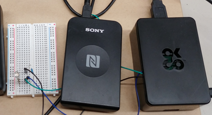

# 入退室記録システム
## 必要なもの
- [Raspberry Pi](https://www.raspberrypi.com/products/raspberry-pi-4-model-b/)
- [RC-S300](https://www.sony.co.jp/Products/felica/consumer/products/RC-S300.html)
- LED
## 概要
  
学生証や定期などのICカードを登録し、入退室時に登録したカードをタッチするとDiscordに通知を送るシステム
